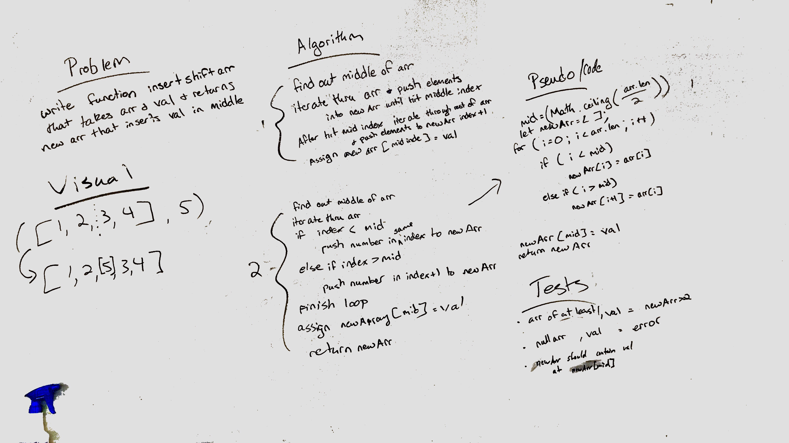

# Overview
Write a function called insertShiftArray which takes in an array and the value to be added. Without utilizing any of the built-in methods available to your language, return an array with the new value added at the middle index.

## Checklist
- [x] Setup repository
- [x] Create whiteboard
- [x] Create test cases for code
- [x] Create code solution using whiteboard as a guide
- [x] Create/update README.md with assignment and team information
- [x] Submit to repo and merge to master branchg
- [x] Turn in assignment

## Team
* Ben Harris
* Jennifer Carrigan

## Whiteboard
