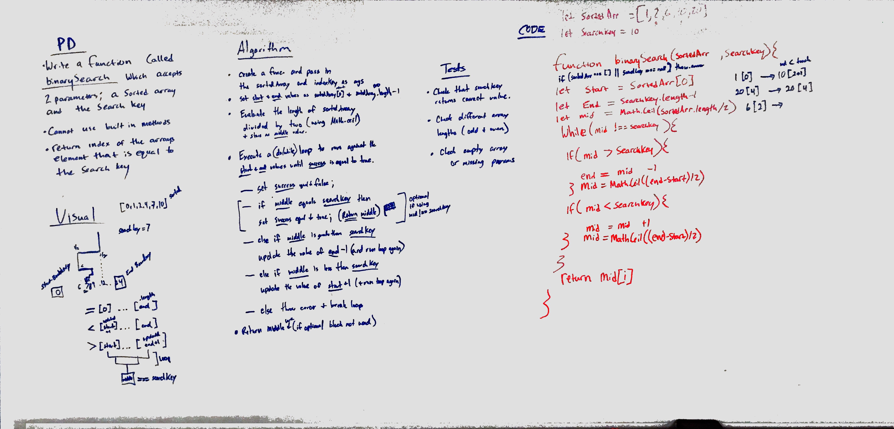

# Overview
Utilize the Single-responsibility principle: any methods you write should be clean, reusable, abstract component parts to the whole challenge. You will be given feedback and marked down if you attempt to define a large, complex algorithm in one function definition.

Write at least three test assertions for each method that you define.

Ensure your tests are passing before you submit your solution.

## Checklist
- [x] Setup repository
- [x] Create whiteboard
- [x] Create code solution using whiteboard as a guide
- [x] Create test cases to check code
- [x] Create/update README.md with assignment and team information
- [x] Submit to repo and merge to master branchg
- [x] Turn in assignment

## Team
* Ben Harris
* Emery Parks

## Whiteboard
