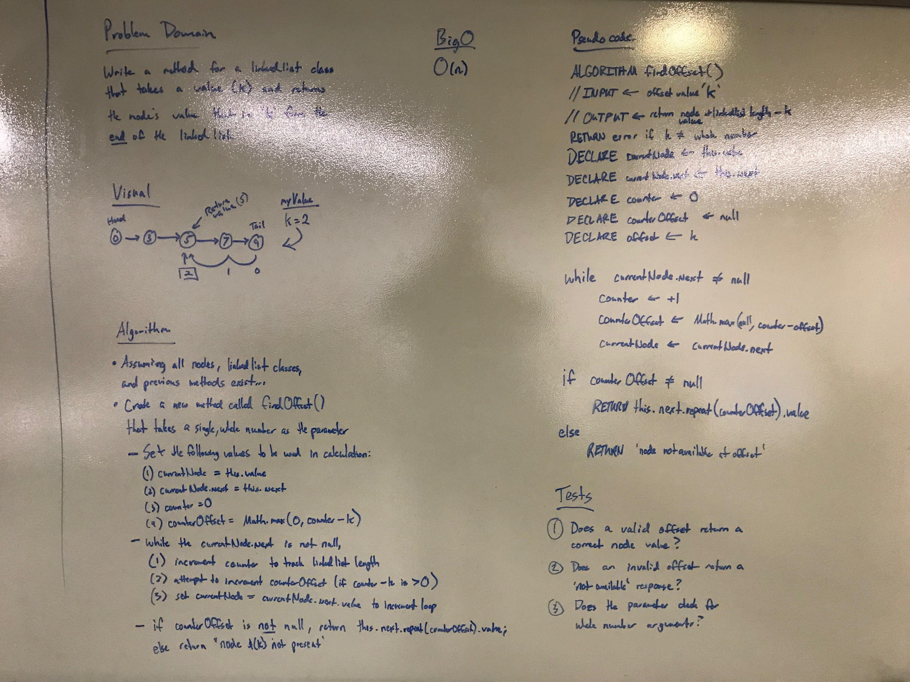

# 07: Linked Lists - Kth from End
## Overview
Write a method for the Linked List class which takes a number, k, as a parameter. Return the node’s value that is k from the end of the linked list. You have access to the Node class and all the properties on the Linked List class as well as the methods created in previous challenges. ​

## Developers
* Ben Harris
* George McCadden III (offsite)

## Checklist
- [x] Setup repository
- [x] Create/update README.md
- [ ] Structure code with comments (algorithm)
- [ ] Create solution
- [ ] Testing
- [ ] Submit to git
- [ ] Turn in assignment

## Whiteboard
