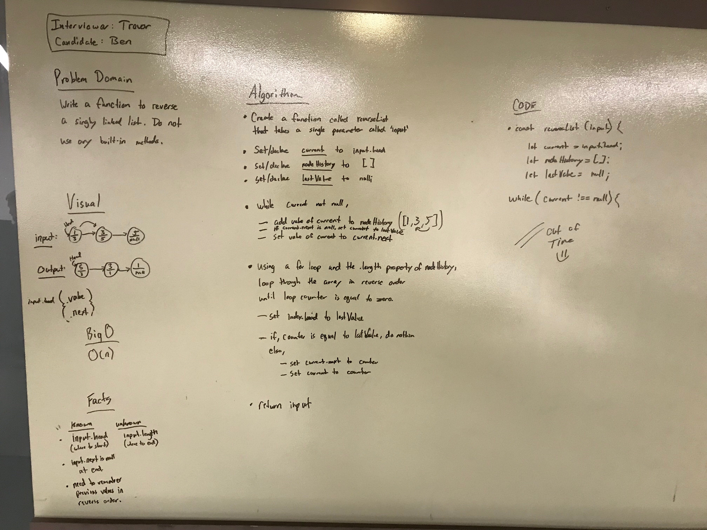

# 09: Mock Interviews
## Overview
Today, you and a peer will take turns interviewing each other with a code challenge. The interviewer will score the candidate according to the Whiteboard Rubric. Notes can be taken in an electronic copy of the doc, or a print out of it. In either case, the completed rubric will be given to the candidate for review purposes. The candidate submits the rubric with the score they achieved as a candidate. Each interview should be time-boxed to a strict 30 minutes.

## Partners
* Ben Harris
* Trevor Stam

## Whiteboard
