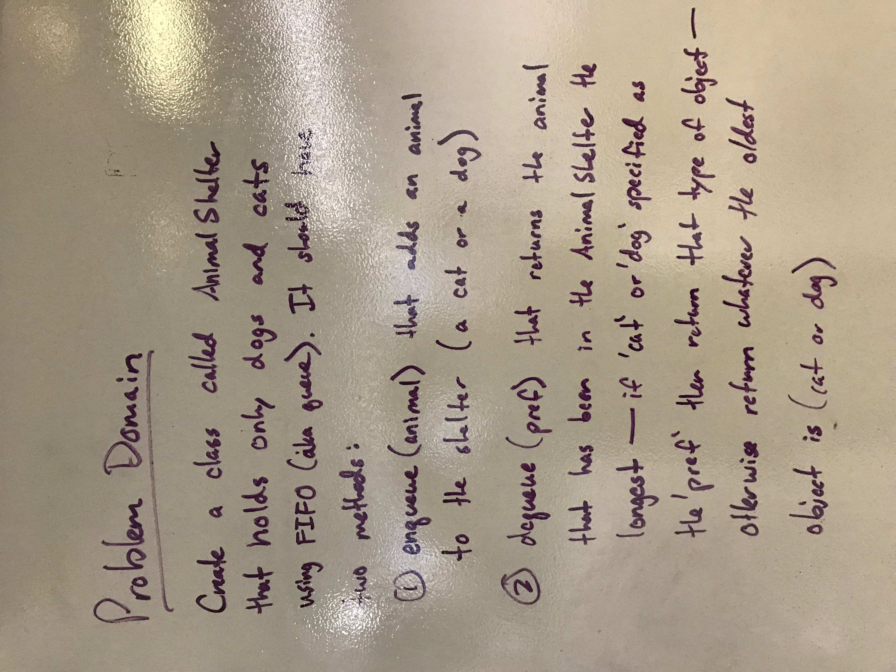
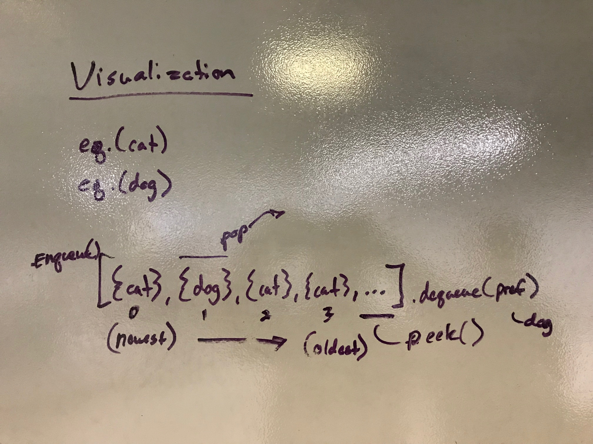
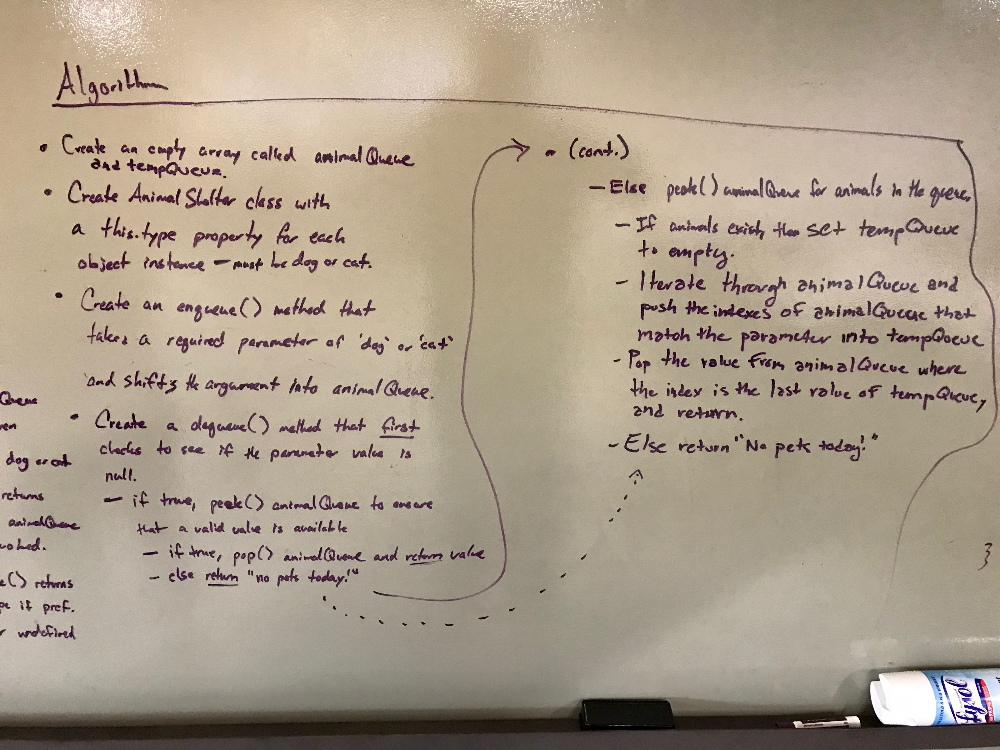
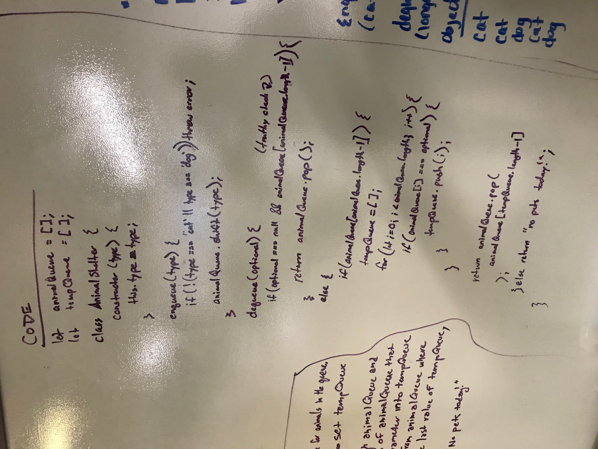
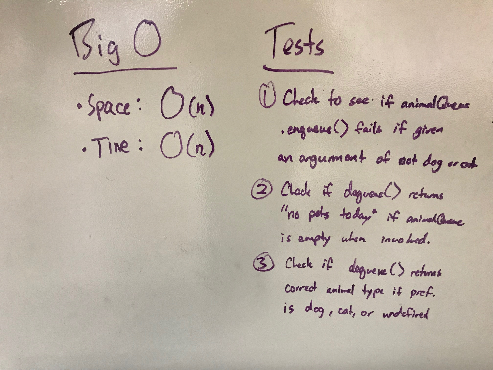

# 12: FIFO Animal Shelter
## Overview
Create a class called AnimalShelter which holds only dogs and cats. The shelter operates using a first-in, first-out approach.
Implement the following methods:
- enqueue(animal): adds animal to the shelter. animal can be either a dog or a cat object.
- dequeue(pref): returns either a dog or a cat. If pref, a string, is ‘cat’ return the longest-waiting cat. If pref is ‘dog’, return the longest-waiting dog. For anything else, return either a cat or a dog.

## Developers
* Ben Harris
* Ryan Milton

## Whiteboard
There are multiple images, so please review each separately. And sorry about the vertical images -- Markdown is doing that auto-magically ¯\\_(ツ)_/¯

