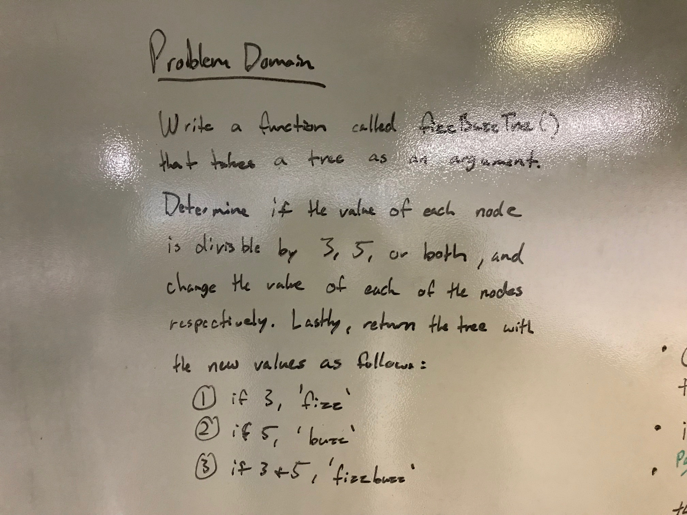
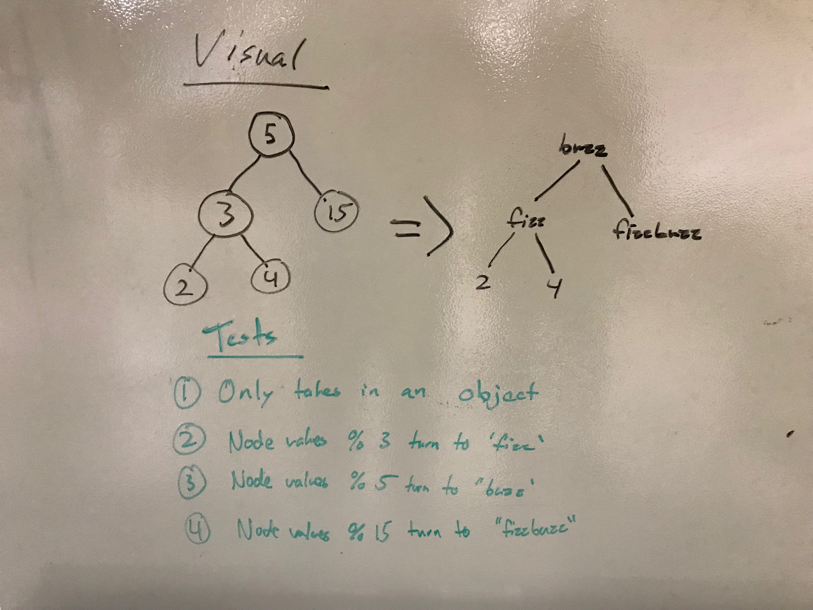
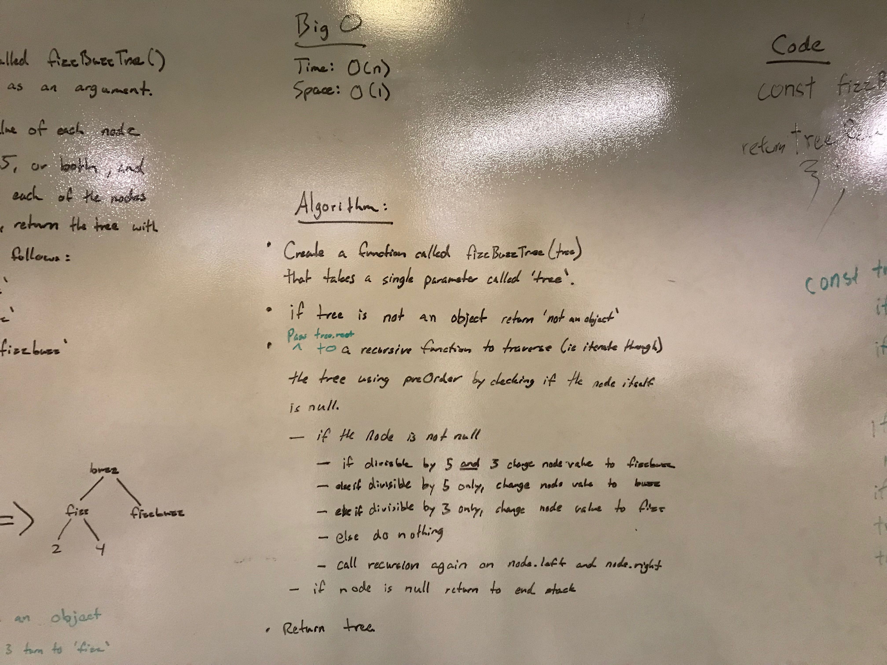
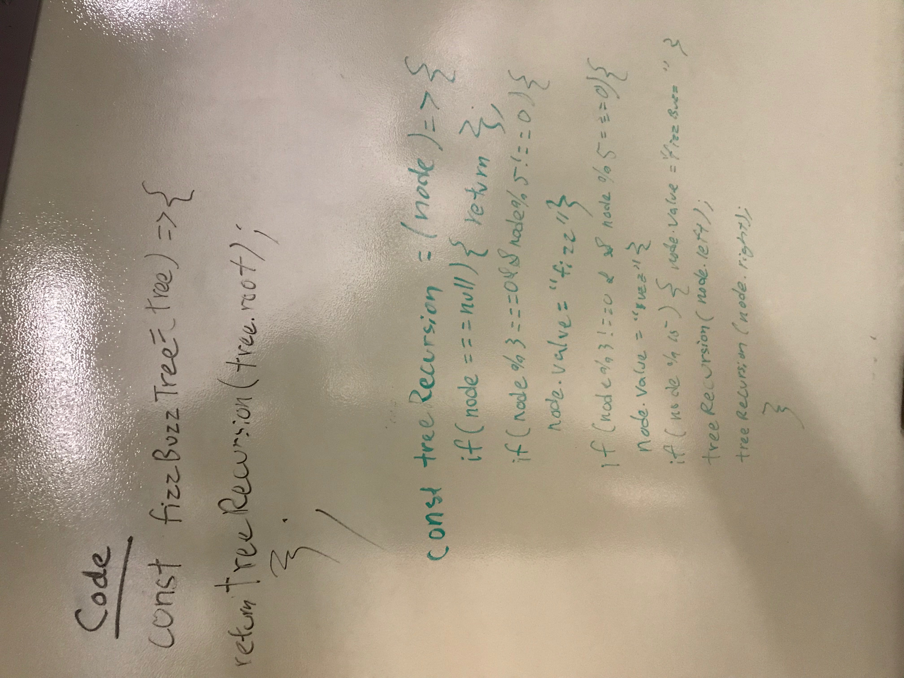

# 16: FizzBuzzTree
## Overview
Write a function called FizzBuzzTree which takes a tree as an argument. Without utilizing any of the built-in methods available to your language, determine weather or not the value of each node is divisible by 3, 5 or both, and change the value of each of the nodes as follows:

- If divisble by 3, change node value to 'fizz'
- If divisble by 5, change node value to 'buzz'
- If divisible by 3 and 5, change node value to 'fizzbuzz'

Finally, the function should return the tree with the new values.

## Partners
* Ben Harris
* Timothy Li

## Whiteboard

