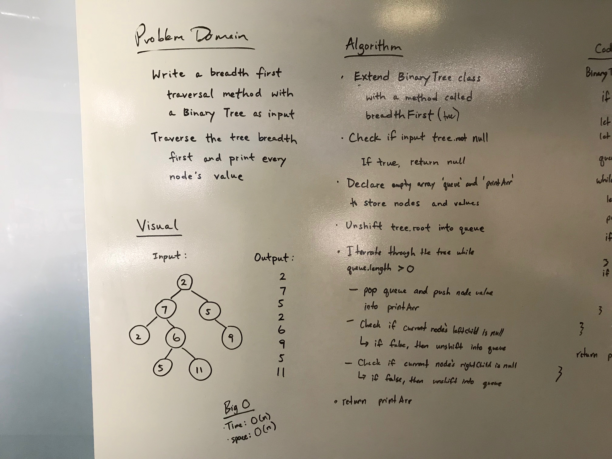
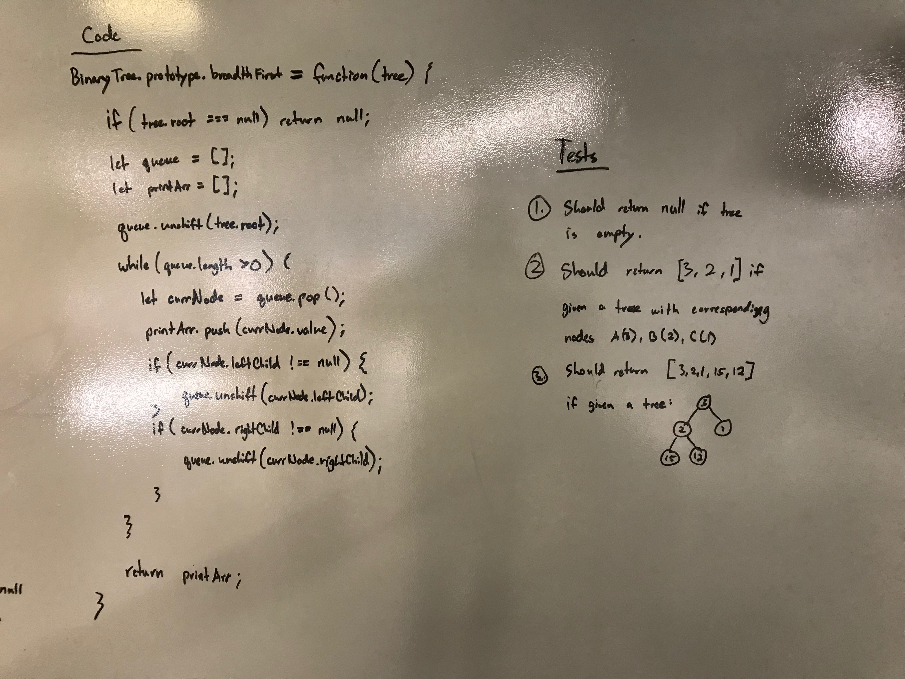

# 17: Breath First Traversal
## Overview
Write a breadth first traversal method which takes a Binary Tree as its unique input. Without utilizing any of the built-in methods available to your language, traverse the input tree using a Breadth-first approach; print every visited node’s value.

## Partners
* Ben Harris
* Katherine Smith

## Whiteboard

