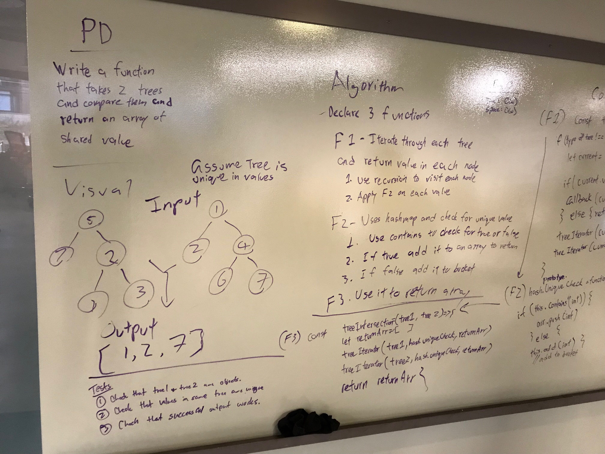
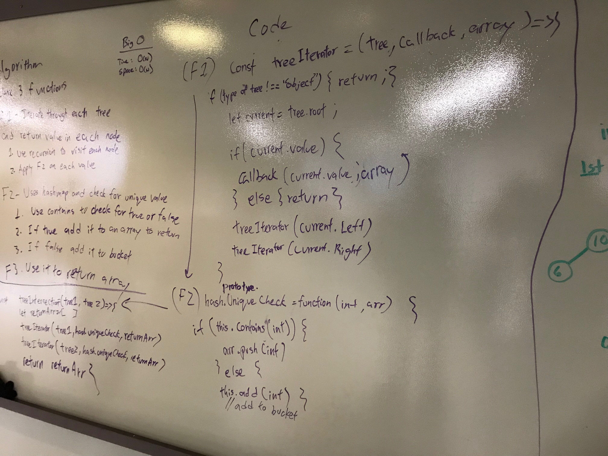

# 27: Tree Intersection
## Overview
Utilize the Single-responsibility principle: any methods you write should be clean, reusable, abstract component parts to the whole challenge. You will be given feedback and marked down if you attempt to define a large, complex algorithm in one function definition. Write at least three test assertions for each method that you define. Ensure your tests are passing before you submit your solution.

## Partners
* Ben Harris
* Timothy Li

## Whiteboard

