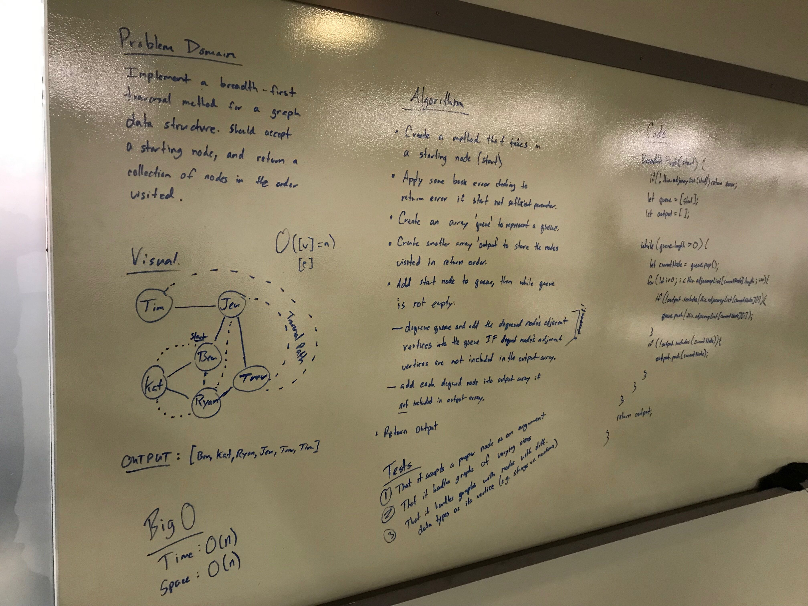
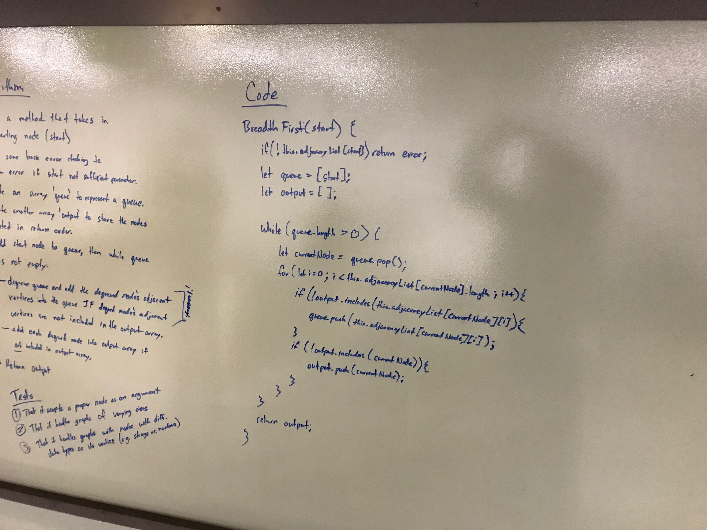

# 31: Breadth First
## Overview
Extend your graph object with a breadth-first traversal method that accepts a starting node. Without utilizing any of the built-in methods available to your language, return a collection of nodes in the order they were visited. Display the collection.

## Partners
* Ben Harris
* Katherine Smith

## Whiteboard

